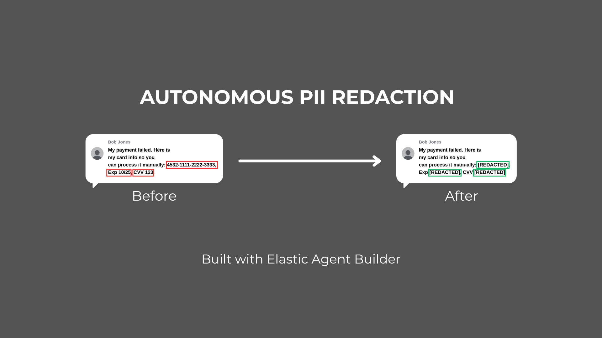

  

## Inspiration

Data privacy compliance is a nightmare for modern organizations. While companies spend millions on "static" security tools and perimeter defenses, data leaks often happen in the messy, human reality of support tickets, chat logs, and internal notes. Traditional regex-based tools are noisy and lack context—they flag a user saying "I forgot my password" just as aggressively as someone pasting "My password is hunter2", drowning security teams in false positives.

We were inspired by the "Automate messy internal work" track. We wanted to build an agent that acts like a human compliance officer: one that can instantly scan massive datasets, understand the *context* of a potential leak, consult corporate policy, and take reliable action to fix it before an audit is required.

## What it does

**The Data Guardian** is an autonomous AI agent built with Elastic Agent Builder that proactively monitors your data streams for PII (Personally Identifiable Information) leaks and remediates them in real time. It transforms a database from a passive storage unit into a self-healing system.

It operates in a continuous, four-step loop:
1.  **DETECT:** It uses high-speed ES|QL tools to instantly filter thousands of documents for high-risk keywords, finding the needle in the haystack.
2.  **REASON:** It uses an LLM to distinguish between safe contexts and genuine threats. It goes a step further by querying a Corporate Policy Vector Store (RAG) to cite specific rules (e.g., "Section 4.2 of PCI-DSS") to justify its decisions.
3.  **ACT:** If a genuine leak is detected, the Agent triggers a predefined Elastic Workflow to surgically redact the sensitive data from the document in the source index.
4.  **REPORT:** Every action is logged to an immutable audit index that powers a real-time, CISO-ready Kibana dashboard showing "Active Threats Neutralized."

## How we built it

We built The Data Guardian entirely natively on **Elastic Cloud Serverless**, leveraging the full power of the new Agent Builder ecosystem:

*   **Agent Builder:** Served as the core orchestrator, containing the system prompt that defined the "Compliance Officer" persona and managing the tool-calling logic.
*   **ES|QL (Tool):** We built a custom `scan_support_tickets` tool using ES|QL to efficiently query the index and extract the internal `_id` of suspicious documents.
*   **Elastic Workflows (Tool):** We built a `redact-pii-ticket` workflow that the Agent can invoke to safely update the Elasticsearch index with the sanitized text, ensuring the LLM doesn't have raw write access.
*   **Retrieval-Augmented Generation (RAG):** We created a `company-policies` index containing compliance documentation that the Agent searches to ground its reasoning.
*   **Kibana Dashboards & Lens:** Used to visualize the output of the Agent's actions from the `audit-logs` index.

## Challenges we ran into

The biggest challenge was bridging the gap between the Agent's reasoning and the actual execution of the state change. Initially, the Agent struggled to pass the correct identifier to the Redaction Workflow.

We learned that standard queries return the business ID (e.g., "Ticket-1002"), but the update workflow required the internal Elasticsearch `_id`. We solved this by diving deeper into ES|QL and using the `METADATA _id` command in our scanning tool, allowing us to capture the internal ID and pass it directly into the Workflow parameters via the Agent's context window.

## Accomplishments that we're proud of

We are incredibly proud that we built an agent that takes **reliable action**. It is very easy to create a chatbot that *suggests* redaction; it is much harder to build an autonomous system that safely modifies the database state in accordance with policy.

Seeing the Agent autonomously differentiate between a false positive and a real credit card number, cite a specific corporate policy as justification, and then successfully trigger a workflow to replace the text with `[REDACTED]`—all while we watched the Kibana dashboard tick upward—was our major "Aha!" moment.

## What we learned

We learned that **context is everything in automation.** LLMs are powerful not just for generating text, but for making nuanced decisions that traditional programmatic rules cannot. Furthermore, we learned the immense value of keeping the entire agentic loop—from data ingestion to search, reasoning, and workflow execution—within a single, unified platform like Elastic Cloud.

## What's next for The Data Guardian

This MVP proves the concept of self-healing data. Our next steps include:
*   **"Human-in-the-Loop" Workflows:** For low-confidence detections, the Agent will pause, send a Slack message to a security officer for approval, and then execute the redaction workflow.
*   **Multi-Modal Scanning:** Expanding the Agent's tools to scan attached PDFs or images within support tickets for sensitive data using OCR integration.
*   **External Integrations:** Packaging the Agent as an MCP server so it can be called directly from external CI/CD pipelines to scan code commits for hardcoded secrets before they are merged.